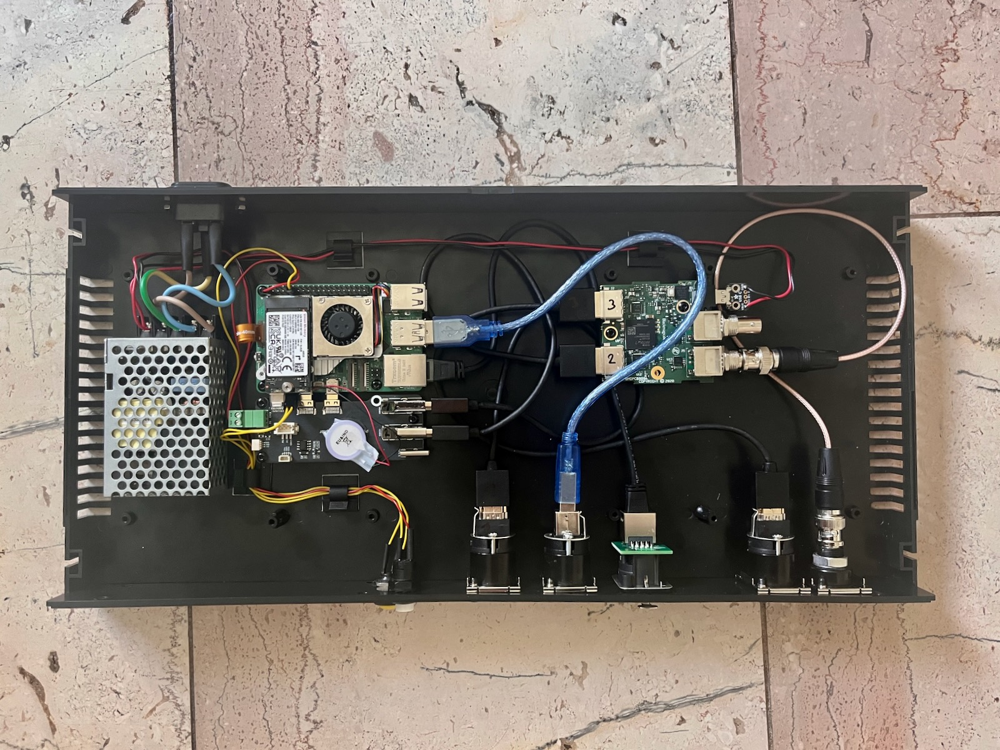
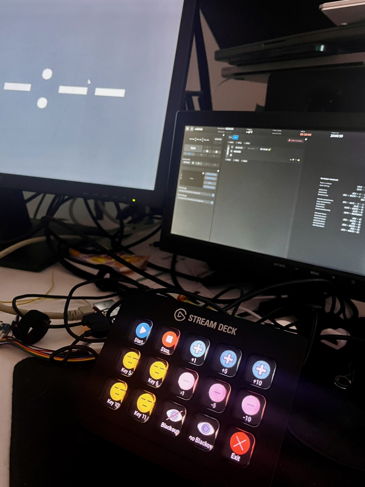
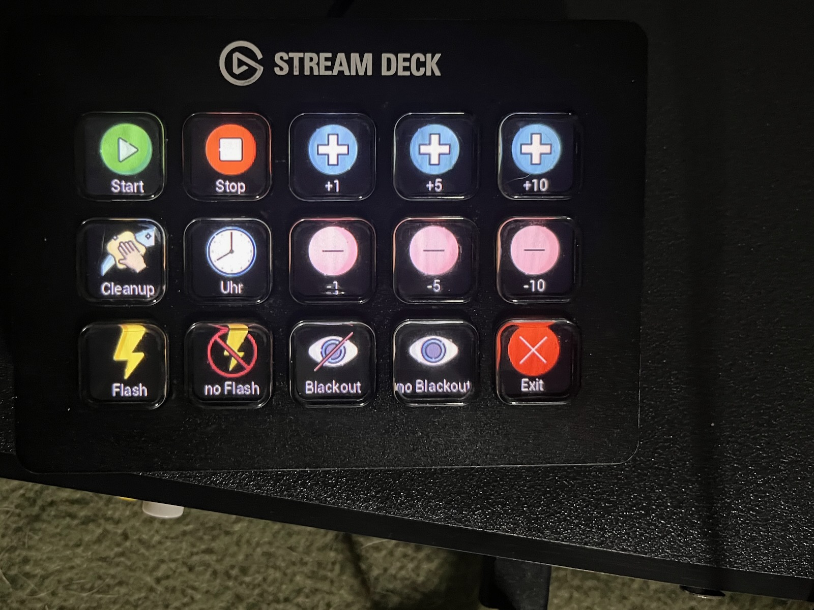
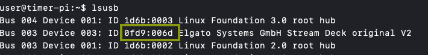

# Timer-Pi v2







raspbian Lite Image
cat /etc/os-release
```
PRETTY_NAME="Debian GNU/Linux 12 (bookworm)"
NAME="Debian GNU/Linux"
VERSION_ID="12"
VERSION="12 (bookworm)"
VERSION_CODENAME=bookworm
ID=debian
HOME_URL="https://www.debian.org/"
SUPPORT_URL="https://www.debian.org/support"
BUG_REPORT_URL="https://bugs.debian.org/"
```

## Allgemeine Anpassungen

### Static IP + DHCP

/etc/network/interfaces.d/eth0.conf
```
allow-hotplug eth0
iface eth0 inet dhcp

iface eth0 inet static
       address 10.99.99.250/24

iface eth0 inet static
       address 192.168.10.173/24
```

### Disable Bluetooth/Wifi 
```
sudo systemctl disable wpa_supplicant.service
sudo systemctl disable hciuart.service
sudo systemctl disable bluealsa.service
sudo systemctl disable bluetooth.service
```

/boot/firmware/config.txt
```
# Disable Bluetooth
dtoverlay=disable-bt
 
# Disable WiFi
dtoverlay=disable-wifi
```

remove Bluetooth/Wifi packages
```
sudo apt purge bluez bluez-firmware wpasupplicant
sudo apt-get autoremove
```

hide Last Login
```
touch /home/user/.hushlogin
```

### raspi-config 
- Autologin mit console

## Software Install

### Docker
```
curl -fsSL https://get.docker.com -o get-docker.sh
sh get-docker.sh
```
### X11
```
sudo apt-get install --no-install-recommends xserver-xorg-video-all \
xserver-xorg-input-all xserver-xorg-core xinit x11-xserver-utils \
chromium-browser unclutter
```

### python 
```
sudo apt-get install python3-pip
sudo apt-get install python3-pil
sudo apt-get install python3-numpy
sudo apt-get install python3-spidev
sudo apt-get install python3-gpiozero
sudo apt-get install python3-elgato-streamdeck
```

### chromium Profile folder
```
mkdir -p /home/user/.chromium/profile1
mkdir -p /home/user/.chromium/profile2
```

## Setup Streamdeck integration
### "Install" Service
```
ln -s /home/user/streamdeck/streamdeck.service /etc/systemd/system/streamdeck.service

```
### Update the udev rules file as needed
I tested this only with my own Streamdeck v1 (Model: 20GAA9902)
```
user@timer-pi:~$ lsusb
Bus 004 Device 001: ID 1d6b:0003 Linux Foundation 3.0 root hub
Bus 003 Device 003: ID 0fd9:006d Elgato Systems GmbH Stream Deck original V2
Bus 003 Device 001: ID 1d6b:0002 Linux Foundation 2.0 root hub
Bus 002 Device 001: ID 1d6b:0003 Linux Foundation 3.0 root hub
Bus 001 Device 001: ID 1d6b:0002 Linux Foundation 2.0 root hub
```
Use the Vendor ID and Product ID within the udev rules.d "42-streamdeck.rules"


```
ATTRS{idVendor}=="0fd9", ATTRS{idProduct}=="006d", TAG+="systemd", ENV{SYSTEMD_WANTS}="streamdeck.service"
```


### Streamdeck Integration
Based on this script.<br>
https://github.com/abcminiuser/python-elgato-streamdeck/tree/master
